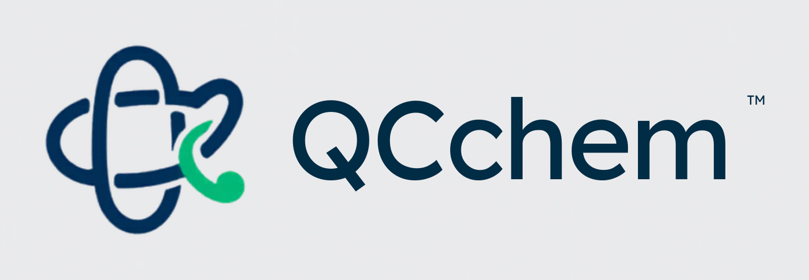

<p align="center">
  
</p>

# QCchem

QCchem is an artifact-first quantum chemistry research workflow built on
Qiskit, Qiskit Nature, PySCF, and local Trust-First release checks. It is not a
single VQE demo. The project connects calculations, reports, benchmark suites,
studies, scans, Runtime probes, Workbench pages, AI tickets, and release audits
through the same evidence language.

The current release line is `0.1.0a1`. Its goal is conservative scientific
delivery: every public surface should say what claim is being made, which
baseline supports it, how large the error is, which trust tier applies, and what
the next careful action should be.

## Install

Use Python 3.10 or newer in an isolated environment:

```bash
python -m venv .venv
source .venv/bin/activate
python -m pip install --upgrade pip
python -m pip install -e ".[dev]"
```

Optional extras:

```bash
python -m pip install -e ".[ui]"       # Dash workbench
python -m pip install -e ".[runtime]"  # IBM Runtime helpers
python -m pip install -e ".[ai]"       # AI workspace provider adapter
python -m pip install -e ".[cudaq]"    # Optional upstream CUDA-Q Python API
```

For the local MKL-Q source prefix on this Mac, use the Python ABI that matches
the installed extensions:

```bash
PYTHONPATH=/Users/a0000/.cudaq-mklq /opt/anaconda3/bin/python3 -m qcchem.cli.main run -c configs/h2_cudaq_mklq_cpu.yaml -o artifacts/h2_cudaq_mklq_cpu
```

## First 10 Minutes

Run a validated local H2 calculation:

```bash
qcchem run -c configs/h2.yaml -o artifacts/h2_local
```

Inspect a config before running it:

```bash
qcchem inspect -c configs/lih_active_vqe.yaml
```

Regenerate a Markdown report from a saved result:

```bash
qcchem report artifacts/h2/result.json
```

Run the local Trust-First release audit:

```bash
qcchem release audit \
  -c configs/release/trust_first_audit.yaml \
  -o artifacts/release_audit
```

Validate the Gamma-only PBC/PBC-QMMM surface:

```bash
qcchem validation pbc-qmmm --profile smoke -o artifacts/pbc_qmmm_validation_smoke
```

Start the local Workbench when UI extras are installed:

```bash
qcchem workbench serve
```

Open `docs/user_manual.md` for the full task-oriented guide.

## What QCchem Verifies

| Surface | Status | Use it for | Boundary |
| --- | --- | --- | --- |
| H2 exact/statevector, LiH active-space VQE, H2O active-space exact | Validated local evidence | Release-facing chemistry examples with explicit baselines | Still read `evidence_summary` before making claims. |
| CUDA-Q/MKL-Q optional local targets | Optional simulator evidence | `cudaq_statevector` and `cudaq_sample` checks through the CUDA-Q Python API | `mklq-cpu` is the default local simulator target; `mklq-metal` is explicit experimental mixed Metal/CPU smoke evidence. Neither sets `hardware_verified`. |
| Gamma-only PBC and PBC-QM/MM Ewald | Validated v1 slice | Supercell PBC and fixed-charge PBC-QM/MM smoke/full validation | No non-Gamma mapped quantum algorithms, forces, stress, PME dynamics, runtime submission, or uniform-background neutralization. |
| LR-ACE flagship | Gated method evidence | Low-rank-factor-informed local runs and curated flagship benchmark artifacts | LR-ACE flagship is not a blanket publication-grade claim; each artifact must pass its trust-first gate. |
| Runtime and hardware probes | Hardware-verified plumbing when collected | Submission, sidecar persistence, result collection, budget-ledger review | `hardware_verified` means runtime provenance exists, not chemistry validation. |
| QFT / finite-cutoff lattice-QED | Exploratory finite-model evidence | Sparse projected exact checks, Gauss-law audits, dynamics/resource studies | Finite-model exactness is not continuum chemistry accuracy. |
| TC-QSCI | Exploratory research evidence | Determinant selection and CAST-guided sampling studies | It remains outside the validated release surface. |
| AI Workspace and Research OS | Local analysis surfaces | Evidence-aware tickets, objective planning, claim review, promotion review | They do not submit hardware jobs or promote exploratory artifacts automatically. |

See `docs/verified_scope.md` for the full validated, exploratory, unstable, and
placeholder boundary map.

## Command Map

| Task | Command |
| --- | --- |
| Run one calculation | `qcchem run -c <config.yaml> -o <artifact_dir>` |
| Inspect a config | `qcchem inspect -c <config.yaml>` |
| Regenerate a run report | `qcchem report <artifact_dir>/result.json` |
| Recommend an active space | `qcchem active-space recommend -c <config.yaml> -o <json>` |
| Run a benchmark suite | `qcchem benchmark run -c <suite.yaml> -o <artifact_dir>` |
| Evaluate benchmark acceptance | `qcchem benchmark accept <benchmark_result.json>` |
| Run a study or scan | `qcchem study run ...` / `qcchem scan run ...` |
| Run a custom workflow | `qcchem workflow validate|run|report|plugins|template ...` |
| Build an artifact index | `qcchem artifacts index artifacts` |
| Validate an evidence capsule | `qcchem artifacts capsule <artifact_dir> -o <output_dir>` |
| Plan or summarize a Research Objective | `qcchem objective init|plan|status ...` |
| Review a claim | `qcchem claim check --claim-file <txt> --target <artifact>` |
| Review exploratory promotion | `qcchem promote exploratory --artifact <result.json> --target <label>` |
| Run artifact-only campaigns | `qcchem campaign run -c <campaign.yaml>` |
| Run exploratory workflows | `qcchem exploratory run -c <config.yaml>` |
| Collect a Runtime result | `qcchem runtime collect <artifact_dir>` |
| Run release audit | `qcchem release audit -c configs/release/trust_first_audit.yaml` |
| Summarize release status | `qcchem release status --audit-dir artifacts/release_audit --strict` |
| Write CI release evidence handoff | `qcchem release evidence-handoff --audit-dir artifacts/release_audit` |
| Verify downloaded release diagnostics | `qcchem release verify-artifacts --artifact-dir <downloaded-artifacts>` |
| Collect post-CI release evidence | `qcchem release collect-evidence --artifact-dir <downloaded-artifacts>` |
| Serve Workbench | `qcchem workbench serve` |
| Smoke-test Workbench routes | `qcchem workbench smoke --docs docs/workbench.md` |

`qcchem release evidence-handoff` writes the CI-side summary and reviewer
handoff before diagnostic upload. After downloading CI artifacts,
`qcchem release collect-evidence` reruns the digest verifier and writes the
post-download Workbench smoke JSON, compact summary JSON, matrix baseline JSON,
and reviewer-facing Markdown handoff in the selected evidence directory. Pass
`--baseline-summary <previous-release_matrix_summary.json>` to compare the
current matrix artifacts against an earlier collection without treating expected
matrix drift as artifact-integrity failure. When retained release evidence lives
under one history directory, pass `--baseline-search-root <history-dir>` instead
to auto-select the newest prior `release_matrix_summary.json`; an explicit
`--baseline-summary` always wins.

Runtime-capable commands require an explicit `--confirm-runtime-budget` phrase
before any real IBM Runtime submission can proceed.

## Artifact Contract

A normal run writes a directory under `artifacts/` with:

- `result.json`: structured result payload.
- `report.md`: human-readable report.
- `resolved_config.yaml`: resolved config snapshot.
- `run.log`: execution log.
- `exact_result.json`: exact baseline when available.
- `quantum_evidence.json`: Pauli, trajectory, constraint, resource, and error
  evidence when materialized.

Output paths must be dedicated artifact directories. QCchem refuses root/home
paths, the repository root, the top-level `artifacts/` directory, and
source-tree paths outside `artifacts/` before it creates or replaces outputs.
Relative `run.output_dir` values resolve under the workspace that owns the
config file; a standalone external YAML writes next to that YAML instead of back
into the QCchem checkout.

Field-model runs also write the `field_*.json` sidecar family for registry,
Hamiltonian sectors, observables, dynamics, constraints, resources, and error
budgets. Runtime runs write `runtime_submission.json` as soon as a real job id
or runtime attempt is available.

Read `evidence_summary` first. It is the common contract used by reports,
Workbench, release audit, and AI tooling:

- `primary_scientific_claim`
- `primary_baseline`
- `primary_error_metric`
- `chemical_accuracy_status`
- `runtime_evidence_status`
- `trust_tier`
- `recommended_action`

## Trust Boundaries

Keep these statements precise in README text, reports, papers, and AI prompts:

- `hardware_verified` means runtime provenance was submitted and retrieved or
  can be collected. It does not imply chemical accuracy.
- QFT sparse exact artifacts defend finite-cutoff model consistency. They split
  accuracy into `finite_model_exactness`, `continuum_chemistry_accuracy`, and
  `hardware_accuracy`.
- When `pauli_materialization=skipped`, QCchem records
  `pauli_terms_available: false` and exposes `sparse_exact_validation` metadata
  instead of writing a fake zero Pauli Hamiltonian.
- LR-ACE flagship artifacts may be recommended method evidence only when their
  local exact-baseline and validation gates pass.
- TC-QSCI remains exploratory; CAST Hamiltonians guide sampling, while the
  selected subspace is diagonalized with the physical Hamiltonian.
- A release audit pass is a local readiness check. It performs no runtime
  submission and does not upgrade exploratory evidence to validated evidence.

## AI Workspace

The Workbench includes a floating research copilot shell plus the `/ai-workspace`
ticket hub. Drafted requests stay evidence-aware and ticket-mediated; accepted
tickets can validate, run, and summarize custom workflows through the same local
artifact and provenance paths as the CLI.

## Common Workflows

### Structure Files

Configs may use `molecule.structure_file` with optional
`molecule.structure_format`. QCchem supports XYZ, PDB, MOL/SDF V2000, and MOL2
without requiring RDKit or ASE:

```bash
qcchem run -c examples/h2_from_xyz.yaml -o artifacts/h2_from_xyz_local
```

The run provenance records raw file SHA-256, normalized geometry SHA-256,
resolved path, selected record/model, and atom count. Do not combine
`molecule.geometry` and `molecule.structure_file` in the same config.

### Benchmarks, Studies, And Scans

```bash
qcchem benchmark run -c benchmarks/benchmark_suite_v1.yaml -o artifacts/benchmark_suite_v1_local
qcchem study run -c configs/studies/mini_comparison.yaml -o artifacts/mini_comparison_study_local
qcchem scan run -c configs/scans/h2_short_scan.yaml -o artifacts/h2_short_scan_local
```

Aggregate workflows preserve case-level artifacts and add suite/study/scan JSON,
Markdown, tables, registries, and acceptance summaries. They refuse to replace a
non-empty output directory unless you rerun with `--overwrite`.

### Research OS

```bash
qcchem objective plan \
  -c configs/objectives/h2_local_validation.yaml \
  -o artifacts/objectives/h2_local_validation_plan

qcchem artifacts capsule artifacts/h2 -o artifacts/capsule_smoke/h2

qcchem claim check \
  --claim-file examples/claims/hardware_overclaim.txt \
  --target artifacts/hardware_calibration_suite_v1 \
  -o artifacts/claim_reviews/hardware_overclaim

qcchem promote exploratory \
  --artifact artifacts/h2_lr_ace/result.json \
  --target validated_algorithm_candidate \
  -o artifacts/promotion/h2_lr_ace
```

These commands are local analysis-only paths for best evidence, trust tier,
baseline strength, overclaim detection, and promotion review.

### Custom Workflows

```bash
qcchem workflow validate -c examples/workflows/h2_trust_first_workflow.yaml
qcchem workflow run -c examples/workflows/h2_trust_first_workflow.yaml
qcchem workflow plugins
```

Custom workflows use YAML as the source of truth, write
`workflow_result.json`, `workflow_report.md`, `workflow_graph.json`,
`provenance.jsonl`, `registry.json`, and step outputs, and can load installed
Python step plugins from the `qcchem.workflow_steps` entry point group. The
Workbench `/workflow-studio` page reads the same protocol. `workflow run` and
`campaign run` also reject existing non-empty output directories by default; add
`--overwrite` only when replacing that whole output bundle is intentional.

### Exploratory Research Assets

```bash
qcchem exploratory run -c configs/exploratory/h2_4site_lattice_qed_sparse_exact.yaml
qcchem exploratory run -c configs/exploratory/h2_lr_ace.yaml
qcchem exploratory run -c configs/exploratory/h2_tc_qsci.yaml
```

For curated QFT, LR-ACE, and TC-QSCI release demonstrations, use
`docs/release_showcase.md` and keep the exploratory boundary visible.

## Documentation Map

- `docs/user_manual.md`: task-oriented user guide and command recipes.
- `docs/verified_scope.md`: validated, exploratory, unstable, and placeholder
  scope.
- `docs/release_showcase.md`: repeatable release demo path.
- `docs/release_audit.md`: release audit manifest and output contract.
- `docs/research_objectives.md`: Research Objective workflow.
- `docs/evidence_capsule.md`: Evidence Capsule workflow.
- `docs/claim_compiler.md`: Claim Compiler workflow.
- `docs/promotion_gate.md`: Promotion Gate workflow.
- `docs/workbench.md`: local visual Workbench guide.
- `docs/ai_workspace.md`: AI ticket and provider flow.
- `docs/custom_workflows.md`: YAML workflow engine, plugin contract, artifacts,
  and Workflow Studio guide.
- `docs/developer_guide.md`: contribution, test, warning, and artifact hygiene.

## Development

Install all development extras:

```bash
python -m pip install -e ".[dev,ui,ai,runtime,cudaq]"
```

Run the core checks:

```bash
python -m compileall qcchem
python -m pytest tests -q -W error::scipy.sparse._base.SparseEfficiencyWarning
git diff --check
```

The default pytest gate excludes tests marked `slow` or `stress` and treats
SciPy sparse efficiency warnings as failures. Run bounded slow-smoke checks
explicitly with `python -m pytest -m slow -q`. Reserve
`python -m pytest -m stress -q` for long exploratory stress cases.

Run the release gate:

```bash
qcchem release audit \
  -c configs/release/trust_first_audit.yaml \
  -o artifacts/release_audit
```

Generated release-audit outputs are local review artifacts, not runtime
submissions. In CI, release diagnostics also include a generated manifest with
uploaded-path size and SHA-256 summaries. See `CONTRIBUTING.md` for contribution
rules.

## License, Citation, And Security

QCchem is distributed under the MIT License. See `LICENSE`.

If you use QCchem in research, cite `CITATION.cff`. Security guidance and
secret-handling rules are in `SECURITY.md`.

The QCchem logo and app icon live under `qcchem/workbench/assets/`; branding
notes are in `docs/branding.md`.
